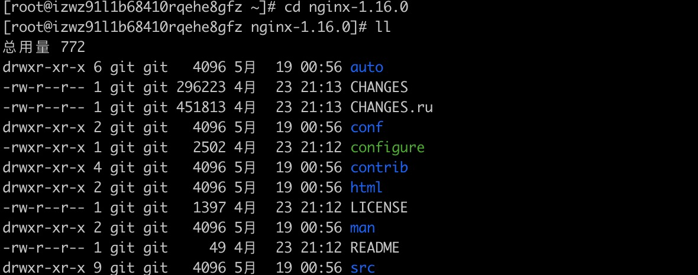
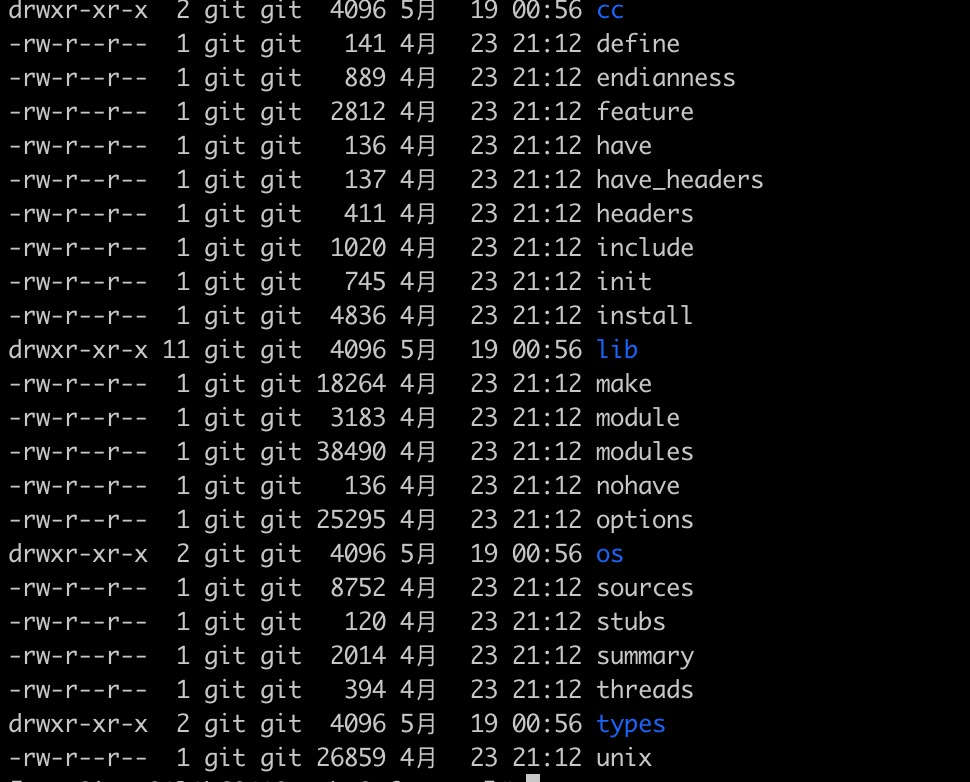
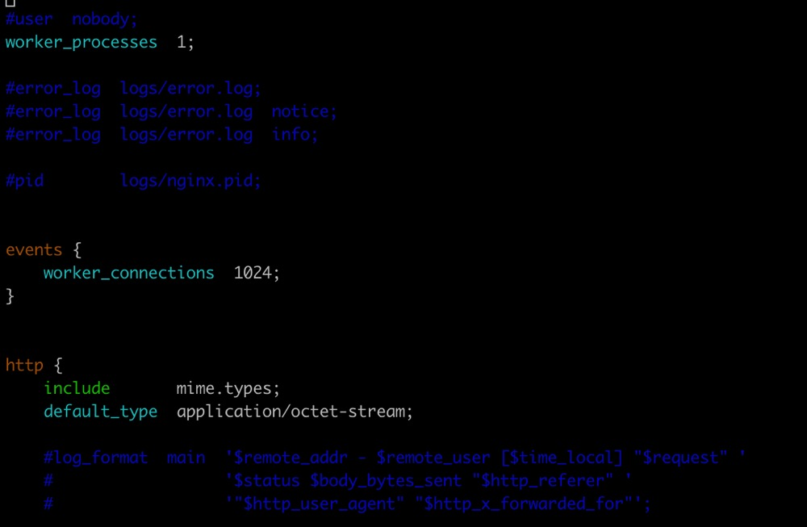
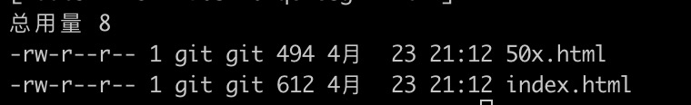
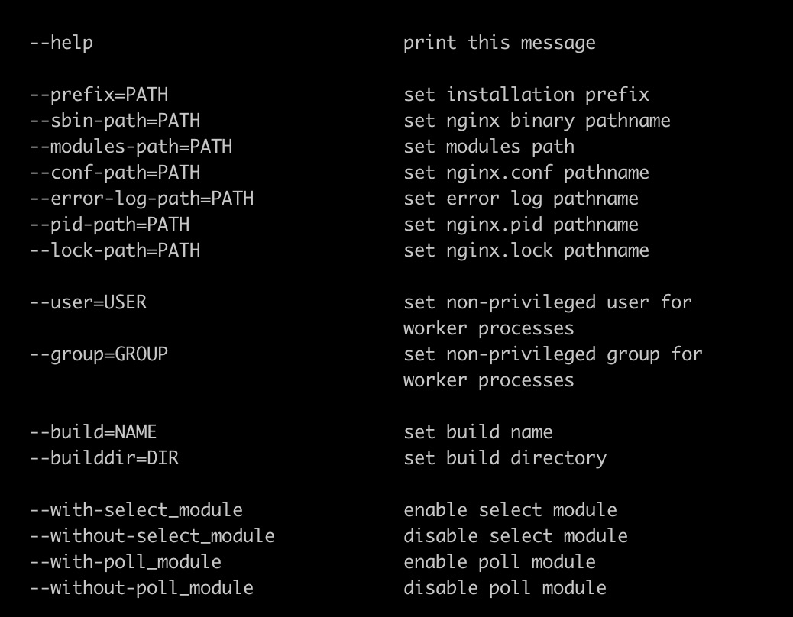
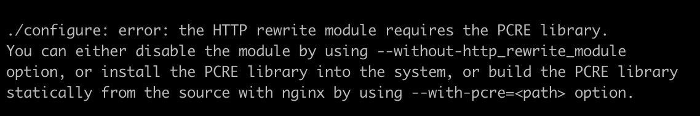
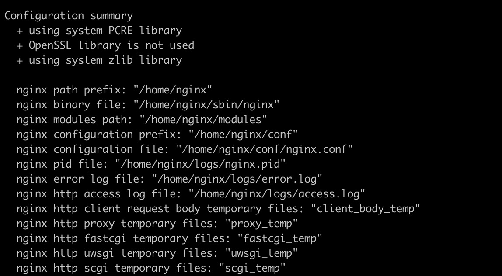

- 为什么使用 nginx

  - 高并发，高性能
  - 可拓展性好(基于良好的模块化设计)
  - 高可靠性(nginx 可以连续运行多年)
  - 热部署(可以不停止 nginx 服务的情况下升级 nginx)
  - BSD 许可证

- nginx 四大组成部分

  - nginx 二进制编码可执行文件(由各模块源码编译出的一个文件)
  - nginx.conf 配置文件(控制 nginx 的行为)
  - access.log 访问日志(记录每一条 http 请求、响应信息)
  - error.log 错误日志(定位问题)

- 如何安装 nginx

  - 下载 ngingx `wget http://nginx.org/download/nginx-1.16.0.tar.gz`
  - 解压 nginx `tar -xzf nginx-1.16.0.tar.gz`
  - 进入 nginx 源码目录 `cd nginx-1.16.0`
    

        - cd auto

    

    - cc 用于编译 - os 用于操作系统判断 - 其他文件都是为了 config 脚本去判定 nginx 支持哪些模块,当前的操作系统有什么特性可以供给 nginx 使用

    - ### CHANGES 是告诉我们这个版本做了什么变更例如 feature、bugfix、Change

    - ### conf 文件是一个示例文件也就是说我们把 nginx 安装好之后为了方便运维开发人员去配置。会把 conf 目录里面的示例文件拷贝到安装目录
    - ### configure 脚本是一个用来生成中间文件执行编译前的必备动作
    - ### contrib 有一个 geo2nginx.pl（geo 模块的 CSV 数据库格式转换 perl 脚本）和 vim 工具(当我们没有使用 vim 工具打开 nginx 配置文件时,它没有 nginx 专用语法高亮配置文件)

      - `cd conf`
      - `vim nginx.conf`

        

        - 此时 vim 中没有显示出 nginx 语法的特性
          我们需要将 contrib 中的 vim 里的所有文件拷贝到自己的目录中`cp -f contrib/vim/* ~/.vim/`就可以看到 vim 打开 nginx.conf 时 nginx 语法的特性了。

    - ### html 目录 里面提供了两个完整的 html 文件

    

        - 500 错误时重定向到 50x.html 文件
        - index.html nginx 的默认欢迎页面

    - ### man 文件是 nginx 的帮助文件和配置
    - ### src 目录是 nginx 的源代码文件

  - ### configure 目录是生成中间文件执行编译前的必备动作
    - 查看 nginx configure 参数`./configure --help | more`
      
    - 第一类只要是确定 nginx 执行过程中,它会去找哪些目录下的文件作它的辅助的文件。动态模块使用--modules-path=PATH --lock-path=PATH 来确定我们 nginx.log 文件放置的位置。如果没有任何变动只需要指定--prefix=PATH 所有的其他的文件会在 prefix 目录下面建相对应的文件夹
    - 第二类是确定使用哪些模块跟不使用哪些模块前缀通常是 --with/--without 通常需要我们加--with 模块基本上是默认不会编译进入 nginx 中的如:--with-http-ssl_module/--with-http-v2_module 而--without 恰好相反
    - 第三类参数是指定 nginx 编译过程中需要的特定的参数如--with-debug 和加入一些第三方模块
  - 执行 configure `./configure --prefix=/home/nginx`
    - 如果没有任何报错就证明 nginx 已经编译成功了
    - 报错以及解决方案
      
      - yum -y install pcre-devel openssl openssl-devel
    - 成功
      
  - 在 configure 执行完成之后会生成一些中间文件,中间文件存放在`objs`这个文件夹下。nginx_modules.c 决定了接下来我们执行编译时有哪些模块会编译进 nginx 中。
  - 执行 make 编译 `make` 如果没有任何错误就代表着编译完成。如下图所示:
    
  - 最后进行 make install `make install`
